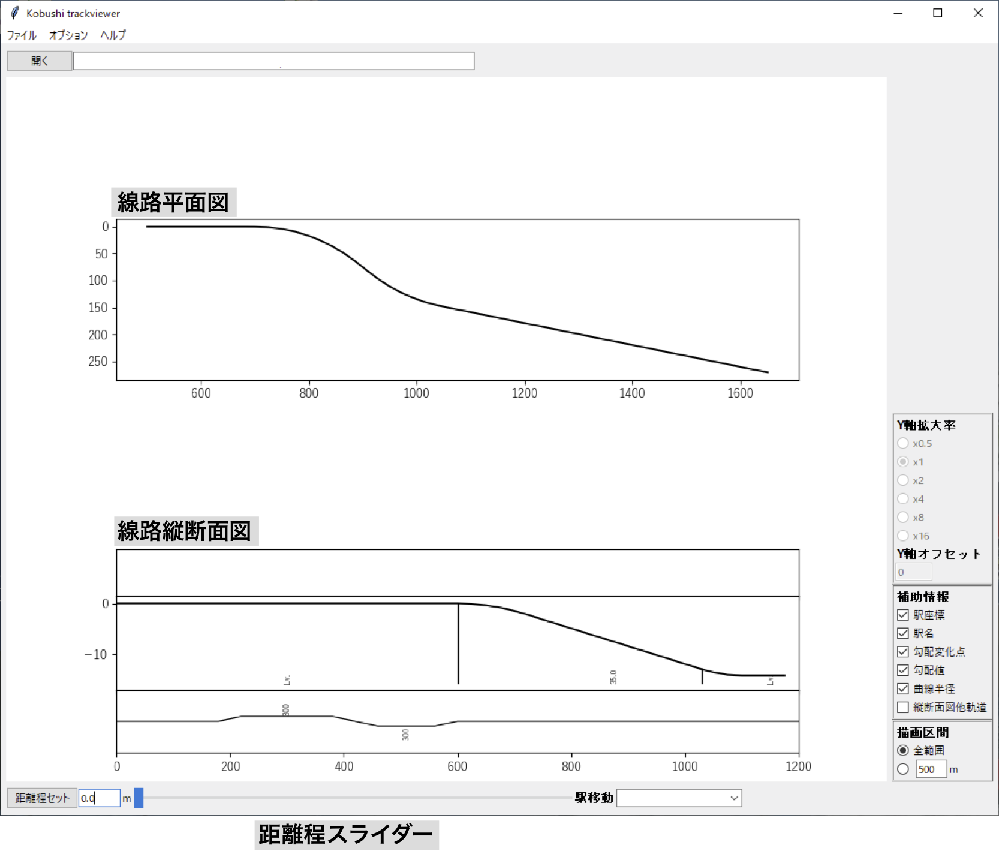
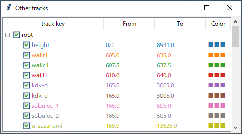

# Kobushi リファレンス

# 目次

* ウィンドウ
    * [メインウィンドウ](#メインウィンドウ)
    * [他軌道ウィンドウ](#他軌道ウィンドウ)
* メニュー
    * [ファイル](#ファイル)
    * [オプション](#オプション)
* 補足
    * [読み込みに失敗する可能性が高いマップファイル](#読み込みに失敗する可能性が高いマップファイル)
    * [マップファイルのエンコーディング](#マップファイルのエンコーディング)
    * [デバッグモード](#デバッグモード)
* [License](#License)
* [Contact](#Contact)

# ウィンドウ
## メインウィンドウ
 
 
 
### Y軸拡大率
線路平面図のX軸に対するY軸の拡大率を0.5~16倍の範囲で設定します。

[描画区間](#描画区間)で「任意範囲」を選択している場合に有効です。

### Y軸オフセット
線路平面図をY軸方向に平行移動させる量を設定します。単位はmです。

[描画区間](#描画区間)で「任意範囲」を選択している場合に有効です。

### 補助情報
線路平面図、縦断面図へ以下の情報を表示するかどうか選択します。
* 駅座標
   * Station[*key*].Put構文が設定されている地点に○シンボルを表示する
* 駅名
   * Station[*key*].Put構文が設定されている地点に駅名を表示する
   * 「駅座標」を表示しない場合はこちらも非表示になる
* 勾配変化点
   * 縦断面図の勾配が変化する地点に区切り線を表示する
* 勾配値
   * 縦断面図に勾配値を表示する
   * 「勾配変化点」を表示しない設定ではこちらも非表示
* 曲線半径
   * 縦断面図に曲線半径を表示する
* 縦断面図他軌道
   * 縦断面図に他軌道の座標を表示する

### 描画区間
線路平面図・縦断面図を表示する区間を設定します。
* 全範囲
   * 表示できる全区間を表示する
   * デフォルトでは、最初の停車場-500m 〜 最後の停車場+500mを表示
   * 表示する区間の変更は、オプションメニュー→[描画可能区間...](#描画可能区間...)で行う
* 任意範囲
   * 入力欄に指定した距離を表示する
   * 区間の移動は[距離程スライダー](#距離程スライダー)で行う

### 距離程スライダー
線路平面図・断面図を表示する地点を設定します。
マウスでの直接操作のほか、Shift+左右カーソルキーでも前後に移動できます。

また、スライダー左の入力欄に表示したい距離程を入力して「距離程セット」を選択すると、指定した地点へ移動できます。

[描画区間](#描画区間)で「任意範囲」を選択している場合に有効です。

### 駅移動
Station[*key*].Put構文が設定されている地点へ線路平面図・断面図を移動します。

リストの順序はStation.Load構文で停車場リストファイルを読み込んだ順番に基づきます。
停車場リストファイルに記載されているが、対応するPut構文が設定されていない停車場も表示されます。

[描画区間](#描画区間)で「任意範囲」を選択している場合に有効です。
## 他軌道ウィンドウ



線路平面図・断面図へ表示する他軌道の設定を行います。

### チェックボックス 
チェックされた軌道を線路平面図・断面図へ表示します。
最上段(root)で全てのチェックボックスを一括してOn/Offできます。
デフォルトでは全てOffです。

### From/To
他軌道を表示する区間を表示します。
デフォルトでは、Fromは対応するTrack要素が初めて現れる距離程、ToはTrack要素が最後に現れる距離程を示します。
値をクリックすると入力画面が現れ、設定値を変更できます。

### Color
他軌道に割り当てられた色を表示します。
■■■をクリックするとカラーパレットが表示され、色の割り当てを変更できます。

# メニュー

## ファイル
### 開く...
マップファイルを指定するファイルダイアログを表示します。
### リロード
一度開いたマップファイルを読み込み直します。
### 図を保存...
現在表示されている平面図・縦断面図をファイルに出力します。
平面図は*hoge*\_plane.*xxx*、縦断面図は*hoge*\_profile.*xxx*として出力されます。 

ファイルフォーマットはpng, svg, any formatから選択できます。
any format を選択するとファイル名に入力した拡張子のフォーマットで出力します。ただし、matplotlibが対応しているフォーマットに限ります。
### 軌道座標を保存...
各軌道の座標情報をcsvファイルに出力します。
ファイルを出力するディレクトリを指定すると、そのディレクトリ名に基づいてファイル名が決まります。
ディレクトリ名*hoge*に対して、自軌道データは*hoge*\_owntrack.csv、他軌道(key: *fuga*)データは*hoge*\_*fuga*.csvとして出力されます。

csvファイルのフォーマットは次の通りです。（方位角、曲線半径，勾配は自軌道データのみに出力）
```
距離程 [m], x座標位置 [m], y座標位置 [m], z座標位置 [m], x軸に対する方位角 [radian], 曲線半径 [m], 勾配 [‰]
```

### 終了
Kobushi を終了します。
## オプション
### 座標制御点...
各軌道の座標を算出する距離程（座標制御点）の条件を変更します。

Kobushi では座標制御点を次のように設定しています。
1. マップ要素が割り当てられた距離程
1. 最初の停車場-500m 〜 最後の停車場+500mの間を25mごとに区切った点

本オプションでは2. の設定について、座標制御点の設定範囲、設定間隔を変更します。
座標制御点の間隔を細分化したい場合に利用してください。

設定を変更した場合は、マップファイルを再度読み込んで座標計算をやり直します。
また、極端に長距離で細かい間隔を指定した場合、メモリを大幅に消費する可能性がありますので、ご注意ください。

### 描画可能区間...
線路平面図・縦断面図を表示できる区間の上限、下限を変更します。
デフォルトでは、最初の停車場-500m 〜 最後の停車場+500mの間を指定しています。

[描画区間](#描画区間)で「全範囲」を指定した場合に表示される区間は、ここで指定された値に基づきます。
停車場が設定されていない範囲を表示したい場合や、「全範囲」で特定の区間のみを表示したい場合などに利用してください。

### 断面図y軸範囲...
線路縦断面図のy軸表示範囲を変更します。
デフォルトでは、自軌道が存在する範囲のみを表示する設定(auto)です。
min, max両方の値を入力する必要があります。

他軌道が範囲外に表示されてしまう場合に利用してください。

# 補足

## 読み込みに失敗する可能性が高いマップファイル

こちらで確認している事例は以下の通りです。
BVE本体では容認される書式でも、kobushiでは受け入れない場合がありますのでご了承ください。

* 変数に多バイト文字を使っている
    * 変数名に利用できる文字は、半角のA-Z, a-z, 0-9, _のみ
* 変数にマップ要素を代入している
* マップ要素のキーがシングルクォーテーションでくくられていない
    * `Track['hoge']`とするべきところが`Track[hoge]`となっている
        * Map 1.xx ではシングルクォーテーションでくくる必要がなかった
* ヘッダーのエンコーディング設定と実際のファイルエンコードが一致していない
* その他、[Map 2.02以降の書式](https://bvets.net/jp/edit/formats/route/map.html)に従っていない

## マップファイルのエンコーディング

マップファイル、停車場リストファイルを読み込む際のエンコーディング設定は、各ファイルのヘッダーでの指定に従います。
読み込みに失敗した場合は、以下の方法でもう一度読み込みを試みます。

* ヘッダーでutf-8指定の場合、Shift-JIS (より正確には[CP932](https://ja.wikipedia.org/wiki/Microsoftコードページ932))で再読み込み
* ヘッダーでShift-JIS指定の場合、utf-8で再読み込み

## デバッグモード
`python -O -m kobushi`として、-O オプションをつけてkobushi を起動すると、デバッグモードが有効になります。

デバッグモードでは、マップ読み込み完了時に以下の情報を印字します。大規模なマップでは印字にそれなりの時間がかかるのでご了承ください。

* 自軌道マップ要素リスト
* 座標制御点リスト
* 自軌道座標データ
* 停車場リスト
* 他軌道マップ要素リスト
* 他軌道キーリスト
* 他軌道座標データ

また、実行中に何らかのエラーが発生した場合にはpython標準のデバッガ[pdb](https://docs.python.org/ja/3/library/pdb.html)が起動します。


# License

Apache License, Version 2.0

# Contact

Author: Konawasabi

Mail: webmaster@konawasabi.riceball.jp

Website: https://konawasabi.riceball.jp/
